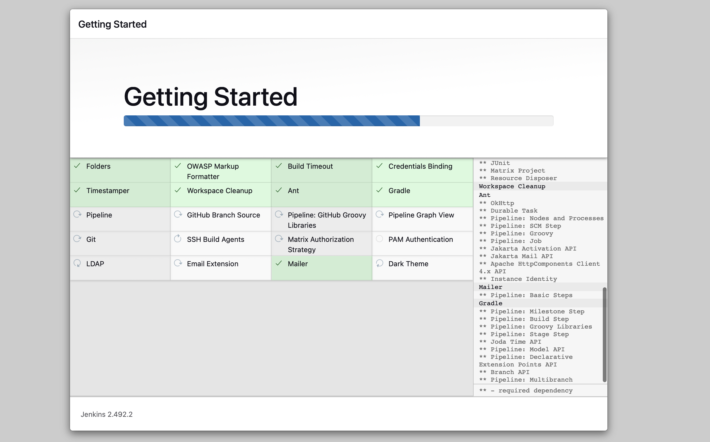
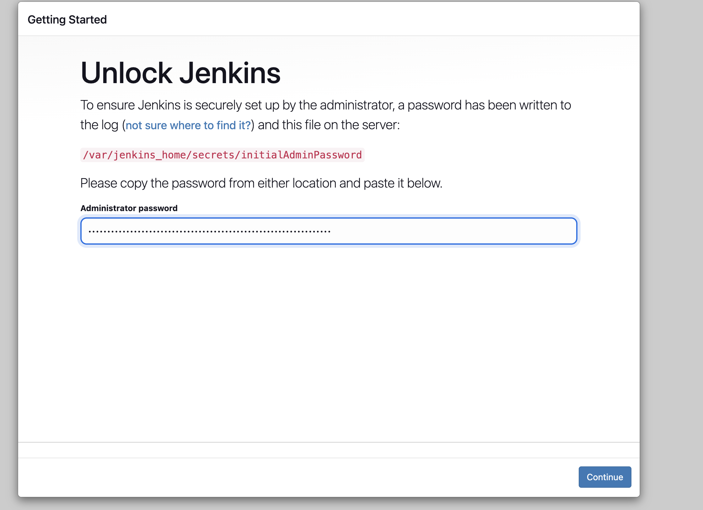
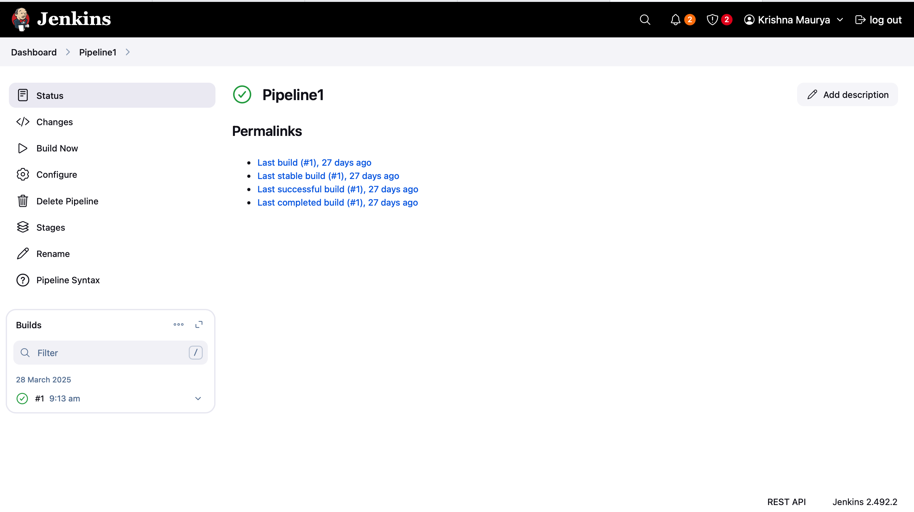
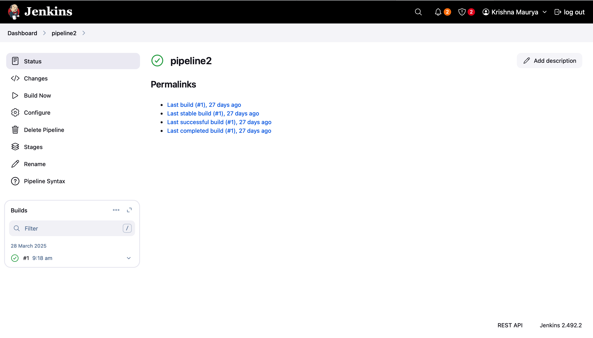
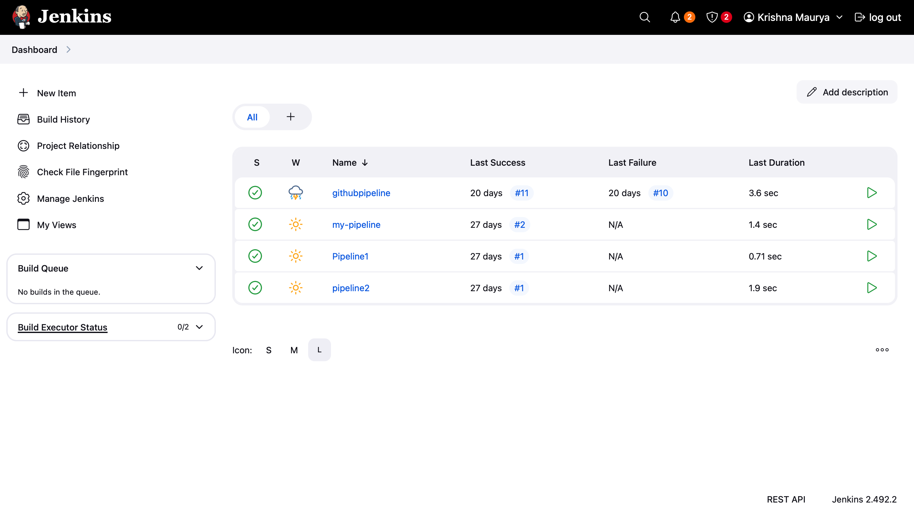

# DevOps Lab 8 – FastAPI Dockerization & CI/CD using GitHub Actions

**Name:** Krishna Maurya 
**SAP ID:** 500107783 
**Roll Number:** R2142221297  
**Program:** B.Tech CSE (Full Stack AI) – Honours  
**College:** UPES Dehradun  
**Lab Title:** Automating Docker Builds with GitHub Actions  
**Repository:** [GitHub - Lab 8]

---

## Objective

To containerize a FastAPI application and automate its Docker image build and push process using GitHub Actions, ensuring a seamless CI/CD pipeline for deployment.

---

## Tools & Technologies Used

- FastAPI (Python web framework)
- Docker / Podman (Container platform)
- GitHub Actions (CI/CD platform)
- Docker Hub (Image registry)
- Git (Version control)

---

## Step 1: Install Podman (Docker Alternative)

**Podman** is a container engine that can serve as a replacement for Docker.

### Installation

1. Download `podman-cli` from [https://podman.io](https://podman.io/)
2. Initialize Podman machine and configure alias:
   ```bash
   podman machine init
   podman machine start
   alias docker=podman
   docker --version
   ```

---

## Step 2: FastAPI Server Code

**File:** `main.py`

```python
from fastapi import FastAPI
import uvicorn

app = FastAPI()

@app.get("/")
def root():
    return {"name": "Krishna", "Location": "Dehradun"}

@app.get("/{data}")
def dynamic(data: str):
    return {"hi": data, "Location": "Dehradun"}

if __name__ == "__main__":
    uvicorn.run("main:app", host="0.0.0.0", port=80, reload=True)
```

---

## Step 3: Requirements

**File:** `requirements.txt`

```
fastapi
uvicorn
```

---

## Step 4: Dockerfile

**File:** `Dockerfile`

```dockerfile
FROM ubuntu

RUN apt update -y && apt install -y python3 python3-pip pipenv

WORKDIR /app
COPY . /app/
RUN pipenv install -r requirements.txt

EXPOSE 80
CMD pipenv run python3 ./main.py
```

---

## Step 5: Build and Run (Manual)

### Build Image
```bash
docker build -t fastapi-Krishna:v1 .
```

### List Images
```bash
docker images
```

### Run Container
```bash
docker run fastapi-Krishna:v1
```

---

## Step 6: GitHub Actions Workflow

**File:** `.github/workflows/DockerBuild.yml`

```yaml
name: Docker image build

on: push

jobs:
  build:
    runs-on: ubuntu-latest

    steps:
      - uses: actions/checkout@v1

      - name: Build & Push Image
        run: |
          echo ${{ secrets.DOCKERTOKEN }} | docker login -u "kriish1107" --password-stdin
          docker build -t kriish1107/fastapi-docker:v0.1 .
          docker push kriish1107/fastapi-docker:v0.1
```

---

## Docker Token Setup

### Steps:

1. Visit [Docker Hub](https://hub.docker.com)
2. Go to **Account Settings > Security > Access Tokens**
3. Generate a token, give it a name, set permissions
4. Copy and store it securely (you’ll use this in GitHub Secrets)

Login using token:
```bash
echo "<your-token>" | docker login -u <your-username> --password-stdin
```

---

## Workflow Explanation

- **Trigger:** The workflow runs on every push to the repo.
- **Steps:**
  1. Checkout code from GitHub
  2. Log in to Docker Hub using stored secrets
  3. Build the Docker image
  4. Push the image to Docker Hub

---

## Outcome

This GitHub Actions workflow automates:
- Building the Docker image
- Logging into Docker Hub
- Pushing the image

This ensures a **faster**, **more consistent**, and **automated deployment** process for your containerized FastAPI application.










